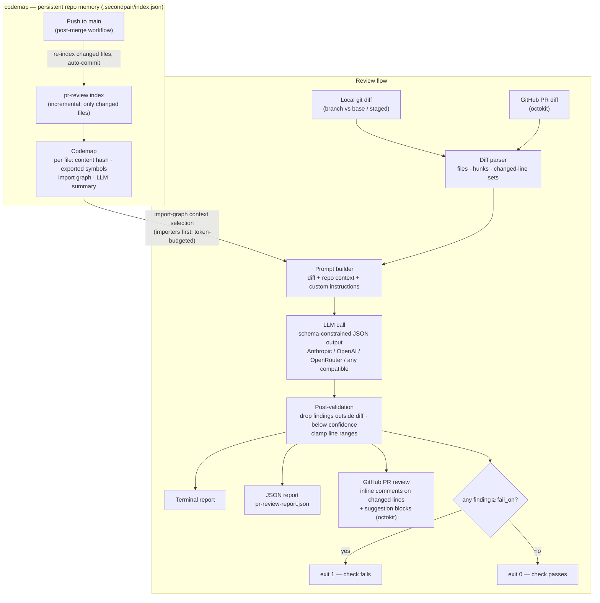

<picture>
  <source media="(prefers-color-scheme: dark)" srcset="assets/secondpair-darkmode-wordmark-cropped.png">
  
</picture>

**LLM-powered PR review with whole-repo context — the second pair of eyes.**
A CLI + GitHub Action that reviews pull requests (GitHub, GitLab, Bitbucket) the way a senior engineer would: knowing the codebase, not just the patch.

[](https://www.npmjs.com/package/secondpair)
[](#license)
[](#setup)

---

One package, two parts:

- **The reviewer** (`secondpair review`) — reviews a diff with an LLM, posts inline comments, gates CI on severity.
- **The codemap** (`secondpair index`/`init`/`mcp`, `src/codemap/`) — an optional, persistent, token-efficient index of the whole repo (symbols, import graph, LLM summaries) that feeds the reviewer whole-project context, and is also reusable by **any** AI tool via MCP server, CLI, or library. Its heavy deps (tree-sitter, MCP SDK) are `optionalDependencies` — plain `secondpair review` never needs them.

### Contents

[The problem](#the-problem) · [Architecture](#architecture) · [What it flags](#what-it-flags) · [Setup](#setup) · [Providers](#providers) · [CI](#2-use-in-any-ci-plan-b) · [Configuration](#5-configuration-pr-reviewyml) · [Sample output](#sample-output) · [How the memory works](#how-the-memory-works--and-how-to-reuse-it) · [Development](#development)

---

## The problem

Manual PR review is one of the most expensive rituals on a team: reviews queue for hours or days, standards drift between reviewers, and the same classes of bugs (off-by-ones, missing tests, unvalidated input) slip through when reviewers are tired. Existing LLM reviewers help, but most of them see **only the diff** — so they miss broken callers, flag "issues" the codebase already handles elsewhere, and can't judge naming or conventions against the rest of the project.

`secondpair` fixes that with the **codemap**, a persistent index: a compact, incrementally-updated index of every file in the repo (exported symbols, import graph, and a one-paragraph LLM summary per file). At review time, the import graph selects the files most relevant to the change — the direct **importers** of changed files (the code that breaks if the change is wrong) and their direct **imports** (the APIs the change relies on) — and injects their summaries into the review prompt under a strict token budget. The reviewer sees the project, not just the patch, without paying to re-read the whole repo on every PR.

After each merge, a workflow re-indexes **only the files that changed** and commits the updated codemap — so the agent's memory of the project stays current as the codebase evolves.

## Architecture



## What it flags

| Category | Examples |
|---|---|
| `bug` | logic errors, off-by-ones, broken error handling, wrong API usage |
| `security` | injection, secrets in code, missing validation at trust boundaries |
| `missing-tests` | new/changed behavior with no test change |
| `naming` | identifiers inconsistent with the codebase's conventions |
| `complexity` | over-long functions, logic duplicated from elsewhere in the repo |
| `custom` | anything your `.pr-review.yml` custom instructions ask for |

Every finding carries a severity (`critical`→`info`), a category, a model-rated confidence, a markdown explanation, and — where possible — a drop-in fix rendered as a GitHub **suggested change**. Findings the model invents outside the diff are dropped by post-validation, and low-confidence findings are filtered by a configurable floor, so the output is a gate, not noise.

---

## Setup

### 1. CLI (local)

```bash
npm install && npm run build     # from a clone
# or: npm install -g secondpair

export ANTHROPIC_API_KEY=sk-ant-...   # see "Providers" for alternatives

# Preferred: set up the brain once (config + git hooks + index)
npx secondpair init
# Or: secondpair index  (same indexer; init also wires up git hooks)

# Review your branch against origin/main (auto-detected)
pr-review review

# Other modes
pr-review review --staged             # review staged changes
pr-review review --base origin/develop
pr-review review --fail-on critical   # override the gate threshold
pr-review index --no-llm              # symbols + import graph only, no API key needed
```

`review` prints a colored terminal report and writes `pr-review-report.json`. Exit code is `1` when any finding is at or above the `fail_on` threshold.

### Providers

The Anthropic API is the default (official SDK, schema-constrained output). Any OpenAI-compatible endpoint also works:

| Provider | Env vars |
|---|---|
| Anthropic (default) | `ANTHROPIC_API_KEY` (model defaults to `claude-opus-4-8`; override with `PR_REVIEW_MODEL`) |
| OpenRouter | `OPENROUTER_API_KEY` + `PR_REVIEW_MODEL` (e.g. `anthropic/claude-sonnet-4.5`) |
| OpenAI | `OPENAI_API_KEY` + `PR_REVIEW_MODEL` (e.g. `gpt-4o`) |
| Any OpenAI-compatible endpoint (LiteLLM, vLLM, Together, …) | `PR_REVIEW_BASE_URL` + `PR_REVIEW_API_KEY` + `PR_REVIEW_MODEL` |
| Local agent CLI (Cursor, Claude Code, …) | `PR_REVIEW_CLI_COMMAND` (e.g. `cursor-agent -p --output-format json` or `claude -p --output-format json`) — no API key; uses your agent subscription |

Force a provider with `PR_REVIEW_PROVIDER=anthropic|openai|openrouter|openai-compatible|cli`; otherwise it's inferred from which key is set.

For the `cli` provider, always pass `--output-format json`: the default `text` format can interleave tool-call/session status (e.g. bash-tool state) into stdout alongside the answer, which breaks JSON parsing. `--output-format json` emits a single clean result object; the `result` field (the CLI's actual answer) is unwrapped automatically.

The **cli provider** pipes the review prompt to the configured command on stdin and expects a JSON answer on stdout (prose/markdown fences around the JSON are tolerated, one repair retry on schema errors). Any headless agent CLI works.

**Determinism:** OpenAI-compatible calls run at `temperature: 0` by default. Anthropic uses adaptive thinking instead (its own consistency mechanism); setting `temperature:` in `.pr-review.yml` applies it there too but turns thinking off. Findings are further stabilized by fingerprints, reconciliation, caps, and (optionally) self-critique — LLM output is managed variance, never assumed to be zero.

Findings carry a stable fingerprint (`id`). Re-runs classify findings as **new / persistent / resolved / suppressed** and only post **new** comments. Suppress noise with [`.pr-review-suppressions.yml`](examples/.pr-review-suppressions.yml) (paste ids from `pr-review-report.json`).

### 2. Use in any CI (Plan B)

**Contract:** checkout the PR → Node 20+ → install CLI → `pr-review review` → keep `pr-review-report.json`.

**Always commit `.secondpair/index.json`** (from local `secondpair init` + hooks). CI should **not** rebuild the brain.

| Recipe | File |
|---|---|
| GitHub Action | [`examples/pr-review.yml`](examples/pr-review.yml) |
| Generic bash (Jenkins/Circle/…) | [`examples/ci-generic.sh`](examples/ci-generic.sh) |
| GitLab | [`examples/gitlab-ci.yml`](examples/gitlab-ci.yml) |
| Bitbucket | [`examples/bitbucket-pipelines.yml`](examples/bitbucket-pipelines.yml) |

```yaml
# GitHub — checkout is required so the committed brain is on disk
jobs:
  review:
    runs-on: ubuntu-latest
    steps:
      - uses: actions/checkout@v4
      - uses: YOUR_GITHUB_USERNAME/secondpair@v1
        with:
          anthropic-api-key: ${{ secrets.ANTHROPIC_API_KEY }}
          fail-on: high
```

```bash
# Any other CI
bash examples/ci-generic.sh
# or: npm i -g secondpair && pr-review review --fail-on high
```

### 3. Bitbucket

Inside Bitbucket Pipelines, workspace/repo/PR are auto-detected — see [`examples/bitbucket-pipelines.yml`](examples/bitbucket-pipelines.yml). Secured vars: LLM key + `BITBUCKET_TOKEN` (`pullrequest:write`) for `--post`.

### 4. GitLab

Inside a `merge_request_event` pipeline, project/MR are auto-detected (`CI_PROJECT_ID` / `CI_MERGE_REQUEST_IID`) — see [`examples/gitlab-ci.yml`](examples/gitlab-ci.yml). For `--post`, set `GITLAB_TOKEN` (personal or project access token with `api` scope; `CI_JOB_TOKEN` cannot post MR notes). Findings land as positioned MR discussions plus one summary note, deduplicated by finding id across runs.

### 5. Configuration (`.pr-review.yml`)

Place at the consuming repo's root — see [`examples/.pr-review.yml`](examples/.pr-review.yml):

```yaml
fail_on: high              # gate threshold: critical|high|medium|low|info
min_confidence: 0.5        # drop findings the model rated below this
ignore:
  - "**/*.gen.ts"          # excluded from review and from the codemap
context_token_budget: 8000 # token budget for injected repo context
context_snippets: 3        # inline full source of the top-N related files (0 = off)
custom_instructions: |
  Flag missing JSDoc on exported functions.
categories:
  naming: false            # disable a category entirely
# temperature: 0           # force on Anthropic too (disables adaptive thinking)
limits:
  max_findings_per_file: 5 # lowest-confidence findings beyond this are dropped
  max_total: 30
self_critique: false       # extra LLM pass that drops findings it would walk back
semantic_dedup: true       # extra LLM pass matching reworded "new" findings against already-posted ones, and against overlapping findings within the same run (same-file only, cheap)
```

Every review ends with one machine-readable line on stderr for CI dashboards:

```
pr-review-summary {"model":"claude-sonnet-5","llmCalls":1,"inputTokens":8123,…}
```

---

## Sample output

> 📸 *Screenshot of a generated PR review comment goes here after the first real run.*

Terminal report:

```
PR Review

Rewrites sum() with a manual loop; the loop bound is incorrect.

src/math.ts
  HIGH [bug] L2-3 Loop reads past the end of the array (95%)
      `i <= xs.length` accesses xs[xs.length] (undefined), making the total NaN.

1 finding(s): 1 high
```

---

## How the memory works — and how to reuse it

1. **`secondpair index`** walks the repo (respecting `.gitignore` + your `ignore` patterns) and stores, per file: a content hash, exported symbol signatures and resolved relative imports (TypeScript compiler API for TS/JS, regex heuristics for other languages), and a one-paragraph LLM summary (batched calls; skipped with `--no-llm`).
2. Runs are **incremental**: only files whose content hash changed are re-extracted and re-summarized; deleted files are pruned. A post-merge workflow keeps the committed index in sync with `main`.
3. At review time, **context selection is deterministic** — no extra LLM call. For each changed file the import graph yields its importers and imports, ranked by how many changed files they touch, packed into `context_token_budget`. That context rides in the prompt alongside the annotated diff.

The index lives at `.secondpair/index.json` in the consuming repo: transparent, versioned with the code, and identical for local runs and CI. The codemap is an optional feature — see [`secondpair install`](AGENTS.md) to install only the platform/codemap dependencies you need.

The memory is **not review-only**. The same index serves any AI tool in your stack:

```bash
# Claude Code, Cursor, Windsurf, … — any MCP client
claude mcp add secondpair -- secondpair mcp
```

That gives every assistant `get_context` (what depends on these files?), `search_symbols` (where is X?), and `file_info` (what does this file do?) over the committed repo memory — no re-reading the codebase, no extra LLM calls. Details, CLI and library API: [`src`](src).

---

## Development

```bash
npm install
npm run build            # tsc → dist/
npm test                 # vitest — LLM calls are mocked, no network
npm run typecheck
npm run smoke:pr-review  # required after any secondpair source change
```

`smoke:pr-review` builds, runs secondpair tests, checks CLI help, and exercises fingerprints / suppressions / reconcile against `dist/`. If an LLM API key is set, it also runs a live review in a temp repo.

## License

MIT
